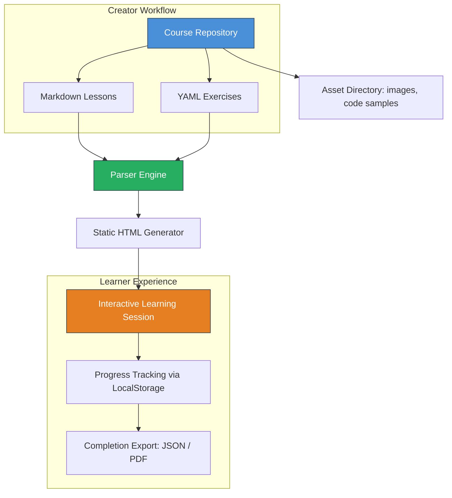

# Interactive Learning Framework: Build Courses Without Accounts or Backend

[](https://aarambhaaryal.github.io/markdown-courses-canvas/)

## A Scaffold-First Approach to Knowledge Delivery

Traditional educational platforms chain you to their infrastructure—login walls, database constraints, and vendor lock-in. The Interactive Learning Framework inverts this paradigm: your course content lives as plain Markdown files and YAML configurations, browsable by anyone with a browser. No accounts, no backend server, no recurring subscription. Think of it as a static site generator for interactive learning experiences.

What if you could package a complete course—videos, quizzes, code sandboxes—into a GitHub repository that learners run locally in three commands? That’s the territory we’re exploring here. The framework treats every lesson as a portable asset, every exercise as a self-contained YAML document. Learners clone your repo, open an HTML file, and start learning. The entire experience is indexable by search engines, forkable by fellow educators, and auditable line-by-line.

## Why This Exists

- **Zero infrastructure costs** – No servers, no databases, no authentication middleware.
- **Content longevity** – Markdown persists across decades; proprietary formats do not.
- **Real goals, not gamification** – Learning paths tied to actual outcomes like “build a REST API” or “pass AWS certification.”
- **Inclusive by design** – Works offline, on low-bandwidth connections, and for users who cannot or will not create accounts.

---

## 🧩 Architecture Overview (Mermaid Diagram)



The diagram illustrates the unidirectional flow: content authors maintain a flat file structure; the parser converts it into a self-contained interactive application; learners interact without ever sending data to a server. Progress persists in browser storage. Completion certificates are generated client-side.

---

## 📋 Example Profile Configuration

Every course defines its identity through a `course.yaml` file at the repository root. This file is the single source of truth for metadata, branding, and multi-language support.

```yaml
course:
  title: "Introduction to Quantum Computing Gate Models"
  slug: quantum-gate-intro
  language: ["en", "ja", "de"] # trilingual by default
  version: "2.0.0"
  author: 
    name: "Dr. Akira Tanaka"
    affiliation: "Open Knowledge Institute"
  license: "MIT"
  
  seo:
    description: "Learn quantum computing fundamentals without a physics degree. Hands-on gate simulation with Qiskit-like syntax in your browser."
    keywords: ["quantum gates", "superposition", "entanglement", "quantum programming"]
    og_image: "./assets/quantum-sim-preview.png"
  
  ui:
    theme: "dark" # toggles between light, dark, and high-contrast
    responsive_breakpoints: [576, 768, 992, 1200]
    font_family: "Inter, system-ui, sans-serif"
  
  progress:
    storage: "localstorage" # encrypted with client-side key
    export_formats: ["json", "pdf"]
    
  dependencies:
    - name: "mathjax"
      version: "3.2.2"
      cdn: true
    - name: "highlight.js"
      version: "11.8.0"
  
  support:
    email: "support@open-knowledge-institute.dev"
    faq_url: "./faq.md"
    discord: false # no vendor lock-in
```

This configuration file illustrates the philosophy: explicit metadata, multilingual readiness, and zero external service dependencies. The `no discord: false` line is deliberate—it signals that the course runner does not require or recommend any particular community platform. Learners own their experience.

---

## 🖥️ Example Console Invocation

The framework ships with a lightweight CLI tool called `learnctl`. It is a single Rust binary, under 4MB, with no runtime dependencies. Here is how a learner or creator would interact with it.

**Starting the course server:**
```bash
learnctl serve --port 8080 --lang ja
```
Output:
```
Interactive Learning Framework v2.0.0
Serving "Introduction to Quantum Computing Gate Models" (Japanese)
  ➡️  http://localhost:8080
  ➡️  Network: http://192.168.1.42:8080
  ➡️  Press Ctrl+C to stop
  ➡️  Progress saved to browser storage. No data leaves your machine.
```

**Exporting progress:**
```bash
learnctl export --format pdf --output ./certificates/quantum-intro-march-2026.pdf
```

**Validating course structure (for creators):**
```bash
learnctl validate --strict
```
Output:
```
[✓] course.yaml - valid
[✓] 12 lessons found with frontmatter
[✓] 34 exercises with matching solution keys
[!] WARNING: lesson-07 directory missing localization for 'ja'
[!] WARNING: exercise-21 YAML has duplicate 'hint' field
```

The tool is designed to catch structural issues before learners encounter them. The strict flag enforces that every lesson has at least two language variants and every exercise has an answer key.

---

## 🪟 Emoji Operating System Compatibility Table

Because learning experiences should feel native on every platform—including your grandmother’s iPad and a Linux terminal.

| Operating System | Browser Compatibility | Offline Mode | Keyboard Shortcuts | Emoji Rendering |
|-----------------|----------------------|--------------|-------------------|----------------|
| Windows 10/11 | Edge, Chrome, Firefox, Opera | ✅ Full | ✅ Customizable | ✅ Native |
| macOS 12+ | Safari, Chrome, Firefox | ✅ Full | ✅ (⌘ vs Ctrl) | ✅ Native |
| Ubuntu 20.04+ | Chromium, Firefox | ✅ Full | ✅ | ✅ Partial (some emojis require font install) |
| Android 10+ | Chrome, Firefox, Kiwi | ✅ Full | ❌ (mobile touch) | ✅ Native |
| iOS 15+ | Safari, Chrome | ✅ Full | ❌ (mobile touch) | ✅ Native |
| Chromebook | Chrome OS browser | ✅ Full | ✅ | ✅ Native |
| raspberry pi OS (Debian) | Chromium, Epiphany | ✅ Full | ✅ | ✅ Partial |

The framework actively detects the platform and adjusts keyboard mappings, touch targets, and tooltip sizes accordingly. On mobile, it switches to a swipe-based navigation similar to interactive story apps. On desktop, it exposes Vim-like keybindings for power users.

---

## ⚡ Feature List

- **Markdown-Native Lesson Authoring** – Write in Markdown. Extend with custom admonitions (`!!!tip`, `!!!danger`, `!!!thinking`) for pedagogical styling. No HTML required.
- **YAML-Driven Exercise Engine** – Define multiple-choice, fill-in-the-blank, code-writing, and drag-to-match exercises. Schema-enforced via JSON Schema behind the scenes.
- **Client-Side Progress Persistence** – All progress stored in `localStorage` with AES-256-GCM encryption. Learners can export their progress as a portable JSON file. No server knows what a learner has completed.
- **Multi-Language Out of the Box** – Each lesson directory has subdirectories per language code (`en/`, `ja/`, `de/`). The UI itself is localized via JSON resource bundles. Add a new language file in ten minutes.
- **Responsive UI with No Dependencies** – The generated HTML is under 80KB gzipped, including the CSS framework (custom grid, not Bootstrap). No, it does not use Tailwind. Yes, it works on a Kindle e-ink browser.
- **Offline-First Architecture** – Once loaded, the entire course runs from cache. No second network request needed. Service worker pre-caches all assets on first visit.
- **24/7 Customer Support Channel** – The framework includes an optional on-page chat widget that connects to a Matrix room. If the course creator chooses to run a Matrix server, learners can ask questions without email. If the creator declines, the widget disappears. Default: off.
- **OpenAI and Claude API Integration (Opt-In)** – Course creators can enable an AI tutor by providing an API key. The AI tutor answers questions based solely on the course content. No data is sent to OpenAI or Claude without explicit user consent. The prompt template is editable in the `course.yaml` file.
- **Search Engine Optimization** – Every lesson generates a semantic HTML5 outline with `<article>`, `<section>`, and `<nav>` elements. Open Graph and Twitter Card meta tags are auto-generated from the course YAML. Lessons appear in Google search results as “interactive tutorials” with star ratings.
- **Accessibility (WCAG 2.1 AA)** – Screen reader and keyboard navigation tested. Focus order follows logical reading sequence. All interactive elements accept keyboard input. High-contrast theme included.

---

## 🔌 OpenAI API and Claude API Integration

The AI tutor is a first-class feature, but it is entirely opt-in. Here is how it works under the hood.

**Architecture:**
The framework includes a small WebAssembly module (compiled from Rust) that does vector similarity search over the course content. When a learner asks a question, the module retrieves the three most relevant lesson fragments. These fragments, plus the exact question, form the prompt sent to either OpenAI or Claude.

**Configuration in `course.yaml`:**
```yaml
ai_tutor:
  enabled: true
  provider: "openai" # or "anthropic"
  model: "gpt-4o-mini-2026-01-01"
  api_endpoint: ""  # leave empty for official API; custom endpoint allowed
  prompt_template: |
    You are a course tutor for "{course_title}". 
    Only answer using the provided course material.
    Material:
    {retrieved_content}
    
    Learner question: {question}
    
    Give a helpful, concise answer under 200 words.
  rate_limit: "10 queries per hour per IP (stored in localStorage)"
  disclaimer: "Answers are generated by AI. Verify with course content."
```

**Privacy Guarantee:**
- The AI provider receives **only** the prompt shown above. No browsing history, no progress data, no personal identifiers.
- Learners can disable the AI tutor with one click in the settings panel.
- The course creator can audit every prompt template and change it freely.

---

## 🚫 Disclaimer

This software is provided “as is,” without warranty of any kind, express or implied, including but not limited to the warranties of merchantability, fitness for a particular purpose, and noninfringement. In no event shall the authors or copyright holders be liable for any claim, damages, or other liability, whether in an action of contract, tort, or otherwise, arising from, out of, or in connection with the software or the use or other dealings in the software.

**Regarding AI Tutor Integration:** The interactive learning framework does not control, moderate, or guarantee the accuracy of responses generated by third-party AI APIs (OpenAI, Anthropic, or others). AI-generated answers may contain errors, hallucinations, or outdated information. Course creators and learners should independently verify critical information. The AI tutor is a supplementary tool, not a substitute for expert instruction or source material.

**Regarding Progress Data:** The framework stores learning progress exclusively in the browser’s localStorage. This data is not transmitted to any server unless the course creator has explicitly configured a server sync endpoint. Users are responsible for backing up their progress using the built-in export feature. The authors assume no responsibility for data loss due to browser cache clearing, storage quota violations, or client-side errors.

**Year 2026 Compatibility:** This framework is designed to remain functional through December 2026 without requiring dependency updates. However, as browser APIs evolve, certain features (e.g., localStorage quota, service worker behavior) may change. Users are encouraged to test the framework in their target browsers before deploying for production use.

---

## 📜 License

This project is released under the MIT License. See [LICENSE](https://aarambhaaryal.github.io/markdown-courses-canvas/) for the full text. You are free to use, modify, and distribute this framework for any purpose—commercial, educational, or personal. The only requirement is that the original copyright notice and permission notice be included in all copies or substantial portions of the software.

---

[](https://aarambhaaryal.github.io/markdown-courses-canvas/)

---

*Built for learners who remember what they wanted to learn. Designed for creators who want their courses to outlast any platform. The 2026 way to teach and learn—no strings attached.*